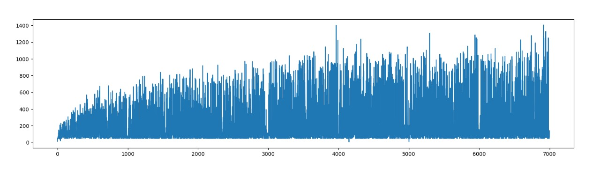
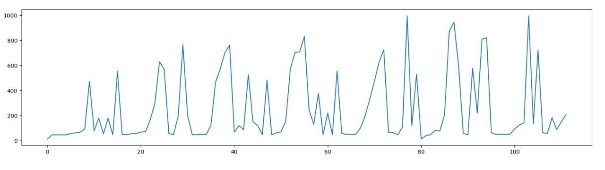

# Para rodar a aplicação
1 - Baixar o chromedriver de acordo com a versão do seu navegador(https://chromedriver.chromium.org/downloads)
<br>
2 - Utilizar um ambiente virtual, de preferência, e instalar as dependências que constam em "requirements.txt"
<br>
3 - Depois disso, você pode treinar o modelo rodando ```python main.py```, onde ele irá rodar mil episódios utilizando 8 threads,
após isso ele irá gerar 3 arquivos: scores.txt (todos os scores dele no jogo), 
scores_per_100.txt (todos os scores medidos a cada 100 episódios) e ws.txt (nosso vetor de pesos).
Então, caso queira continuar treinando basta tirar o comentário entre a linha 34 e a linha 40 e rodar o passo anterior.

# Resultados
### Scores obtidos durante 7000 episódios

Podemos observar que ele foi melhorando com a quantidade de episódios, chegando até 1400 pontos em alguns momentos.
<br>

### Scores obtidos a cada 100 episódios, ignorando o epsilon

Podemos observar que a IA não aparenta estar convergindo, mas mesmo assim ela consegue ter alguns resultados bons.
<br>

### Link para o vídeo
https://drive.google.com/file/d/1ZRAZDY5wUXdAfZ1hrVn0GaenNoJezU8e/view?usp=sharing